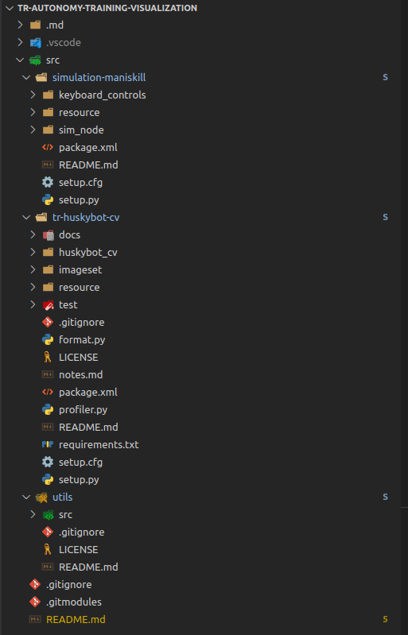
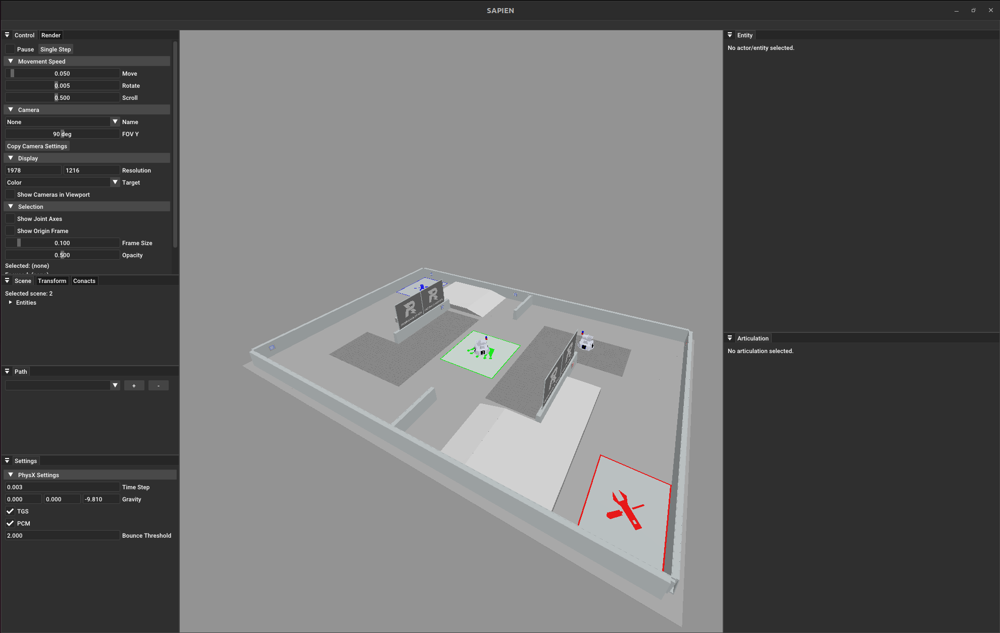
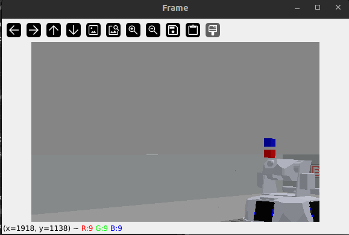
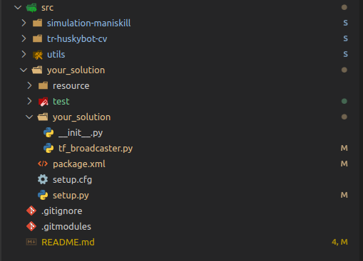
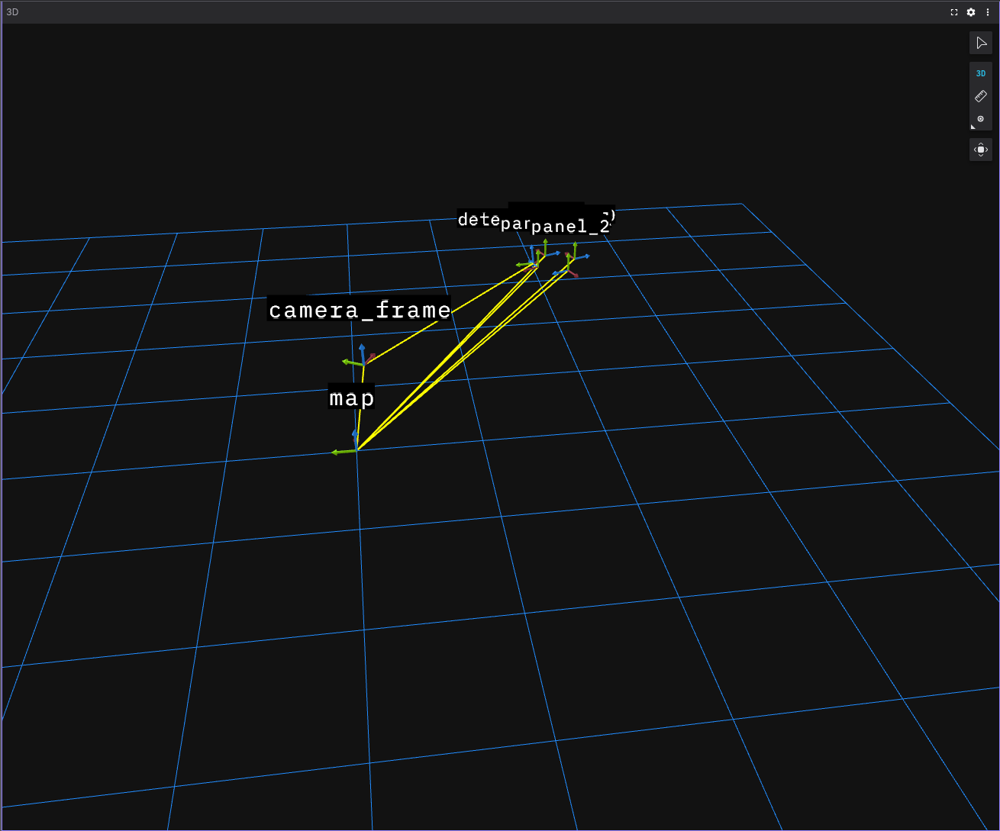
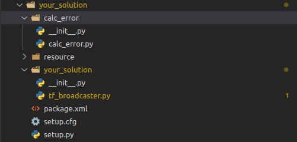
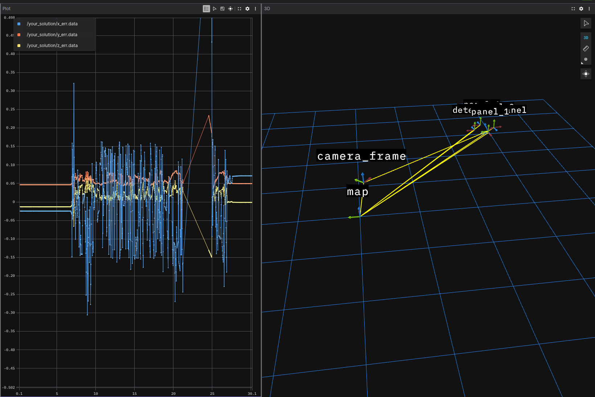
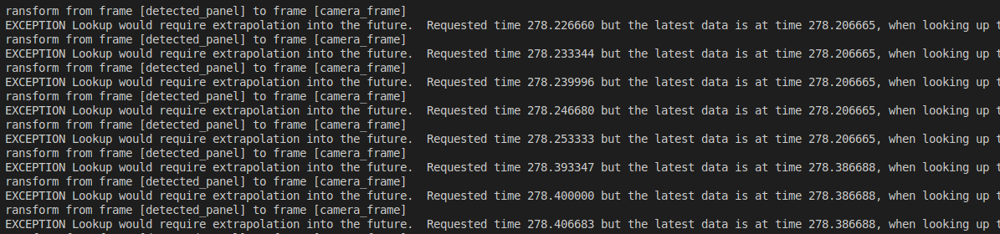

# tr-autonomy-training-visualization

## Introduction

In this training you will create visualizations and logging to determine the accuracy of the HuskyBot cv stack in a simulated environment. Your end result might look something like the video below

[output.webm](https://github.com/user-attachments/assets/1d7bc3bb-b839-484e-9fd0-1a842f532db3)

- __in order to complete this assignment please ask the Autonomy lead to invite you to the Foxglove studio organization__
- This assignment is hard, and a big step up from the previous trainings. If you get stuck you are encourage to talk about your problems and collaborate with fellow recruits in the #auto-support discord channel
- If you do not have much prior experience with robotics [this lecture](https://www.youtube.com/watch?v=jht6k_7LPzY) might be helpful to familiarize yourself with some basic concepts and vocabulary.

## Learning objectives

- understand the importance for good visualizations and logging in the debugging and performance analysis process
- create and incorporate a new package from scratch into a existing workspace
- work in an environment that is closer to the real TR autonomy stack, not just a isolated training workspace
- learn how to work with complex, nested msg interfaces and custom msg interfaces
- learn how to use the tf2 library
- introduction to the TR robot simulator  
- learn how to use rclpy and other python ros2 packages
- reinforce core ros2 skills

## Getting oriented

1. clone this repository
2. run `git submodule update --init` in the root dir of this repo
3. your workspace should look similar to the following. Make sure the submodule directories are not empty and are initialized with files



4. run `colcon build`
5. run each of the following commands __IN THEIR OWN terminal__ (you can have one terminal window and use multiple tabs, or create multiple terminals in vscode)

```bash
# run each in its own terminal. Remember to source ros (source /opt/ros/humble/setup.bash and source the workspace (source install/setup.bash) in each terminal before every command below
ros2 launch sim_node sim_node_launch.py "cv_exposure:=0.8"

ros2 run huskybot_cv huskybot_cv --ros-args -p "use_sim_time:=true"

ros2 run sim_node keyboard_controls
```

Whoa! there's a lot going on. Lets figure out what all those windows are.

This is the human gui for the simulator. You can use wasd and right click drag to control the camera


Try flying around the environment and using the teleop keyboard controls to control the robots! You can learn more about the teleop controls in the [simulation repo README](https://github.com/Triton-Robotics/Simulation-ManiSkill).

Note: You might notice the robots move slower than you expected, this is a side effect of the fact that the simulation might not be running in real time. Each simulation step simulates the passage of 6ms of time. However your machine might take longer than 6ms to simulate that 6ms passage of time. To learn more about how we synchronize the rest of our nodes to this simulation time [read this article](https://design.ros2.org/articles/clock_and_time.html)

This is the window that shows debug information about the Huskybot CV stack


Try using the teleop controls you just learned to point the camera at the armor panel of the opposing robot that has a "3" sticker on it. You should see a bounding box be drawn when it is detected

note: HuskyBot crops the image to be a square so armor panels at the extreme left or right edges of the image frame might not be detected. Try moving the opposing robot closer to the center of the frame if this is a problem

## Part 1 | Broadcasting Transforms

1. create a new package in the `src/` directory of this workspace. Build-type `ament_python`, package name `your_solution`, with a node called `tf_broadcaster`. Your file structure should initially look like the following


2. Familiarize yourself with the [tf2 library](https://docs.ros.org/en/humble/Tutorials/Intermediate/Tf2/Tf2-Main.html). (You should still read through the whole assignment before deep diving into the tf2 docs)

3. Your `tf_broadcaster` node should subscribe to the `/detections` and `/simulation/ground_truth` topics.

You must broadcast the following transforms:

- the detected panel pose from `/detections`
- the ground truth camera pose of the __PRIMARY robot__ from `simulation/ground_truth`
- the ground truth armor panel positions of the __SECONDARY robot__ from `simulation/ground_truth`

You can find the msg types that correspond to those topics in `utils > src > tr_messages > msg`.

helpful links for msg interfaces

- [ros2 custom msg types docs](https://docs.ros.org/en/humble/Tutorials/Beginner-Client-Libraries/Custom-ROS2-Interfaces.html#)
- [vision_msgs docs](https://docs.ros.org/en/humble/p/vision_msgs/__message_definitions.html)
- [geometry_msgs docs](https://docs.ros.org/en/humble/p/geometry_msgs/__message_definitions.html)
- [all ros2 humble packages](https://docs.ros.org/en/humble/p/)

This is what your /tf tree should look like


### A brief aside on poses and coordinate frames

#### Pose

The msg interface for a [geometry_msg/pose](https://docs.ros.org/en/humble/p/geometry_msgs/msg/Pose.html) consists of a [geometry_msgs/Point](https://docs.ros.org/en/humble/p/geometry_msgs/msg/Point.html) and a [geometry_msgs/quaternion](https://docs.ros.org/en/humble/p/geometry_msgs/msg/Quaternion.html). A point and a quaternion together can define the position __and__ orientation of an object. You can learn about the basics of quaternions [here](https://docs.ros.org/en/humble/Tutorials/Intermediate/Tf2/Quaternion-Fundamentals.html)

#### coordinate frames

A coordinate frame can essentially be though of as the origin/frame of reference/relationship that defines what a pose is relative to. Some coordinate frames are static, in our case this is called `map`, tf2 docs sometimes use `world` to refer to this static coordinate frame. Coordinate frames need not always be static however, they can also freely move through space. For this assignment `camera_frame` is a dynamic coordinate frame. The position and orientation of the primary robot's camera defines the origin and orientation of this coordinate frame. Any transform that is a child of `camera_frame` will be relative to the origin and orientation of `camera_frame`

- __Key idea:__ The coordinate frame for all of the ground_truth poses from the simulation are part of the static `map` coordinate frame.

- __Key idea:__ The coordinate frame for the position from `/detections` is in the `camera_frame` coordinate frame. Make sure this makes sense, this is the case because the huskybot cv SolvePnP outputs the translation and rotation vectors in terms of the "screen space" not the global world coordinate system. In other words huskybot has no concept of where the camera itself is in 3d space, and it doesn't need to for the functionality it provides.

__an example:__

lets say `camera_frame` is at (x=2,y=2,z=0) and has a orientation of (w=1,x=0,y=0,z=0), which is the base quaternion that defines forward x axis.

now lets say the `detected_panel` has the coordinate of (1,0,0). From the point of view of the `camera_frame` the coordinate is indeed (1,0,0). However, if you wanted to compare `detected_panel` to `panel_0` you would need to transform it to the `map` coordinate frame. In this case that would be (2,2,0) + (1,0,0) = (3,2,0), the origin of the `camera_frame` + the pose of `detected_panel` gives you the position of `detected_panel` in the `map` coordinate frame.

This was a trivial example so we could compute that in our heads. The computations become a bit more complex if `camera_frame` had a non trivial orientation like (0.707, 0.707, 0, 0). the tf2 library provides an abstraction that keeps track of these various coordinate frames and transforms, allowing us to worry about the logic, not the underlying math of transforms across coordinate frames.

#### transforms

a [geometry_msgs/transformStamped](https://docs.ros.org/en/humble/p/geometry_msgs/msg/TransformStamped.html) follows almost the same format as a geometry_msgs/pose

looking at the message definition we have

- `std_msgs/header header` This is a header that defines the parent frame (`map` or `camera_frame` for this assignment) and the timestamp of this pose
- `string child_frame_id` The word "frame" here might be a little confusing because lets say you are defining `panel_0`, its just a pose, not meant to be seen as a coordinate frame. But, here's the secret: they are essentially the same thing (they are both defined by a 3d point and a quaternion orientation). So this field is just the name of the transform (`panel_0`, `detected_panel`, `camera_frame` etc.) that you can use to look up transforms by name using the tf2 api
- `Transform transform` [geometry_msgs/transform](https://docs.ros.org/en/humble/p/geometry_msgs/msg/Transform.html). This is almost the same format as a geometry_msgs/pose. Read the docs and take note of why there is a semantic distinction between a `point` and a `vector3`

4. Visualize your /tf tree using Foxglove studio


- install and run [foxglove bridge](https://docs.foxglove.dev/docs/visualization/ros-foxglove-bridge)
- create a `3D` panel and your /tf tree should automatically populate it

5. Take a screenshot of the 3D panel in foxglove and upload it to this repo named as `part_1_3d_panel`

### Part 1 notes

- as a reference this is everything you would be running in Part 1 (each in their own terminal)

```bash
# human gui = false to boost performance and because we don't need it for this assignment. Feel free to toggle this back on if it helps you complete this assignment
# You can alternatively change the default value in the sim_node_launch.py file to these values so you don't need to override them manually in the command line
ros2 launch sim_node sim_node_launch.py "human_gui:=false" "cv_exposure:=0.8"

ros2 run sim_node keyboard_controls 

ros2 run huskybot_cv huskybot_cv --ros-args -p "use_sim_time:=true"

ros2 run your_solution tf_broadcaster --ros-args -p "use_sim_time:=true"
```

- ros2 humble docs on [foxglove](https://docs.ros.org/en/humble/How-To-Guides/Visualizing-ROS-2-Data-With-Foxglove-Studio.html) (some of this info is outdated or incorrect)

## Part 2 | Calculating error

1. Create a new directory and file called `calc_error`. Add a empty `__init__.py` file to this directory. Your file structure should look similar to this



2. Modify your `setup.py` to add a new "entry point" to the your solution package so you can run `ros2 run your_solution calc_error`. (you can look at the setup.py of the simulation-maniskill package if you are stuck)

3. Listen to the transforms from the node you wrote in part 1 and use it to calculate the positional error between detected_panel and the four ground truth panels

4. Of the 4 panels choose the panel that is closest to the detected_panel and output the error between that panel and the detected panel to the following topics: `x_err`, `y_err`, `z_err`

5. Use foxglove to visualize your positional error using the "plot" panel.



6. Play with the teleop controls. Move the robots around. Spin them. Experiment with edge cases, etc. Write down your observations about the performance of the HuskyBot CV solvePnP in a text file called `observations.md`. (see if you can recreate that massive jump in x_err in the image above!)

### Part 2 notes

- __IMPORTANT__. This exercise will show you a key limitation of the tf2 library. It is not performant at the millisecond level. Thus if you try fetching transforms at the current time (`self.get_clock().now()`) you will almost always get a exception that the lookup would "require extrapolation into the future." To solve this you must look up transforms slightly in the past. This is acceptable in this case because we have a continuous stream of data and we are using tf2 for logging/visualization purposes, but this shows you why it cannot be used in the core cv logic
- when looking up multiple transforms to calculate the error between them, make sure they are from the same timestamp
- if there is no detected panel at a perticular timestamp you should not publish anything

## Part 3 | Launch Files

You may have felt how cumbersome it was to run each node in a separate terminal. Launch files are a way to streamline this process. But remember, when debugging on a small scale it is sometimes easier to fall back on using the `ros2 run` CLI

1. read the documentation for [launch files](https://docs.ros.org/en/humble/Tutorials/Intermediate/Launch/Launch-Main.html)

2. You should create a launch file inside your `your_solution` package that will launch the following nodes __and__ invoke the `sim_node_launch.py` launch file to start the sim. Create a new package called `my_launch` where this launch file will live

nodes to launch:

- `sim_node keyboard_controls`
- `huskybot_cv huskybot_cv` with `use_sim_time = true`
- `your_solution tf_broadcaster` with `use_sim_time = true`
- `your_solution calc_error` with `use_sim_time = true`
- (`sim_node sim_node` by invoking the `sim_node_launch.py` launch file)

3. Test your launch file and use foxglove to confirm everything is still working correctly.

4. yippie your done! Coordinate with the autonomy lead to have your code for this assignment reviewed

## Pitfalls, problems, and things to watch out for

- You will probably see exceptions like this. While a few of them here and there, especially on startup is fine. If your node is persistently outputting a steady stream of these exceptions something might be wrong.
(I printed when an exception is hit for this demo you may handle it differently)


- __use_sim_time:=true__. This must be set to true for the appropriate nodes. Forgetting this can cause problems
- when creating new packages or creating/deleting new files, running `colcon build` does not remove old files or paths that are no longer being used. Its a good idea to run `rm -r build/ install/ log/` and then run `colcon build` if you modify the file structure
- the `plot` panel in foxglove can have weird behavior if the y-axis scale is set to `auto` consider manually setting a lower and upper bound if your plot is behaving weirdly
