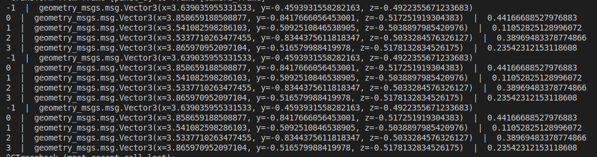

# tr-autonomy-training-visualization

## Introduction

In this training you will create visualizations and logging to determine the accuracy of the HuskyBot cv stack in a simulated environment.
You will use foxglove to easily visualize what is happening. Your end result might look something like the video below

[output.webm](https://github.com/user-attachments/assets/1d7bc3bb-b839-484e-9fd0-1a842f532db3)


__in order to complete this assignment please ask the Autonomy lead to invite you to the Foxglove studio organization__

## Learning objectives

- understand the importance for good visualizations and logging in the debugging and performance analysis process
- create and incorprate a new package from scartch into a existing workspace
- work in an environment that is closer to the real TR autonomy stack, not just a isolated training workspace
- learn how to work with complex and nested msg types and custom msg types
- learn how to use the tf2 library
- introduction to the TR robot simulator  
- learn how to use rclpy and other python ros2 packages
- reinforce core ros2 skills

## Getting oriented

TODO FIXME talk about the submodules here

1. clone this repository
2. run `git submodule update --init` in the root dir of this repo
3. your workspace should look similar to the following. Make sure the submodule directories are not empty and are initialized with files

4. run `colcon build`
5. run each of the following commands __IN THEIR OWN terminal__ (you can have one terminal window and use multiple tabs, or create multiple terminals in vscode)

TODO FIXME NEED TO update this with the launch file for the sim -->

```bash
# run each in its own terminal
ros2 run sim_node sim_node --ros-args -p "cv_exposure:=0.8"

ros2 run huskybot_cv huskybot_cv --ros-args -p "use_sim_time:=true"

ros2 run sim_node keyboard_controls
```

Woah! there's a lot going on. Lets figure out what all those windows are.

This is the human gui for the simulator. You can use wasd and right click drag to control the camera


Try flying around the enviroment and using the telep keyboard controls to control the robots! You can learn more about the teleop controls in the [simulation repo README](https://github.com/Triton-Robotics/Simulation-ManiSkill).

Note: You might notice the robots move slower than you expected, this is a sideeffect of the fact that the simulation might not be running in real time. Each simulation step simulates the passage of 6ms of time. However your machine might take longer than 6ms to simulate that 6ms passage of time. To learn more about how we syncronize the rest of our nodes to this simulation time [read this article](https://design.ros2.org/articles/clock_and_time.html)

This is the window that shows debug information about the Huskybot CV stack

Try using the teleop controls you just learned to point the camera at the armor panel of the opposing robot that has a "3". You should see a bounding box be drawn when it is detected

note: HuskyBot crops the image to be a square so armor panels at the extreme left or right edges of the image frame might not be detected. Try moving the opposing robot closer to the center of the frame if this is a problem

## Your task (Part 1)

1. create a package ament_python in the src/ dir of this workspace. Package name `your_solution` with a node called `tf_broadcaster`. Your file structure should initially look like the following


2. Before you continue [read about tf2 library](https://docs.ros.org/en/humble/Tutorials/Intermediate/Tf2/Tf2-Main.html)

3. Your `tf_broadcaster` should subscribe to the `/detections` and `/simulation/ground_truth` topics.

You must broadcast the following transforms:

- the detected panel pose from `/detections`
- the ground truth camera pose of the __PRIMARY robot__ from `simulation/ground_truth`
- the ground truth panel positions of the __SECONDARY robot__ from `simulation/ground_truth`

This is what your /tf tree should look like

make sure it makes sense why `detected_panel` is a child of `camera_frame`. It is because the huskybot cv solvepnp outputs the translation and rotation vectors in terms of the "screen space" not the global world coordinate system

4. Visualize your /tf tree using Foxglove studio


- install and run [foxglove bridge](https://docs.foxglove.dev/docs/visualization/ros-foxglove-bridge)
- create a `3D` panel and your /tf tree should automatically populate it

ros2 humble docs on [foxglove](https://docs.ros.org/en/humble/How-To-Guides/Visualizing-ROS-2-Data-With-Foxglove-Studio.html) (some of this info is outdated or incorrect)

## Part 2

calculating error

here we run into the performance limitation of tf. So we request transforms 100ms delayed

## Part 3

launch files

## Pitfalls, problems, and things to watch out for

extrapolate into the future/past exception. Should not have many of them

## Key takeaways

tf is good for visualization but not performant

misc notes and stuff
----

1. node to republish image frames with the bounding boxes drawn
2. node to publish the x,y,z error of solvepnp from huskybot using maniskill ground truth
3. node to publish a tf frame and use foxglove to visualize ground truth and observed measurement

import tr_messages DetWithImg
<https://docs.ros.org/en/kinetic/api/vision_msgs/html/msg/Detection2DArray.html>

make sure to launch with sim_time = true

maybe compare the ground truth to the timestamp of the detection vs the timestamp of the camera image
-> artificially adjust the timestamp of the detection to be later in time? might be weird with sim_time

Lessons to learn:
    why we use cpp on the robot? look at the tf exceptions. Even though it only takes "a few milliseconds" to broadcast the transforms, at the scales we work at that is too long

    probably fine for a quick check, but this also tells us that logging and visualizations for 
    millisecond critical code should be written in c++ and tested to see if it can keep up



rename TR-Autonomy
to TR-autonomy

rm -r build/ install/ log/

foxglove consider setting fixed bounds for y axis in the plot settings instead of automatic

you might not want to select "now" as ur timestamp for measuring error. tf2 struggles a bit with real time
and since we are just using this for logging and visualization not real time control we can just say
current time - (some delay) and this will ensure our transform exists in the tf2 buffer and since we recieve a continous stream of data we will log and
visualize every data point

think deeply and be very careful about what timestamp you select for your transform.
the panels transform should match the timestamp of the camera position

## launch node
